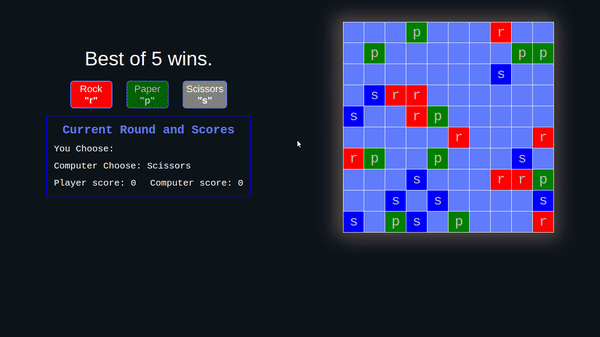

# Rocks Papers and Pairs of Scissors

[Live Demo](https://harunfr.github.io/top-rock-paper-scissors/) :point_left:

This is improved version of classical rock-paper-scissors game. There are 10 stones, paper and scissors initially and only one of those signs survives by converting others.



## Game Logic

- Signs convert other signs if they are neighbor.
- Which sign starts to convert other is randomly chosen with every cycle. It is guaranteed that every sign converts at least one in a cycle.
- Then rocks try to move to the average X and Y value of scissors. All scissors to papers and papers to rocks, accordingly.
- You know opponent's sign at the start.
- If all signs are same, turn ends, whoever choose that sign wins that turn.
- Regarding to bo5 winning rule, whoever wins 3 turns, wins the game.

---

### More Technical Parts of Application.

- To not let all tiles convert to one sign very quickly, I used Array.forEach(...), which guarantees to iterate for only the length of array.
- I used clamp(...) css function to declare font sizes also width and height of cells, and found it very useful. It transfers responsiveness problems to one line, therefore make media query functions simpler.
- I only used Game class in this application, instead I could use Game, Gameboard, Player, Cell classes to make more modular and readable code.
- Game class borrowed React's state setter functions to use in game methods. Instead of polluting App.js I preferred to polute game methods.
- I didn't use any unit test, because this application has randomness in every part.

---

#### Clone, Browse, Build, Run.

```markdown
git clone git@github.com:harunfr/top-rock-paper-scissors.git && cd top-rock-paper-scissors/ && code . && npm i && npm start
```
